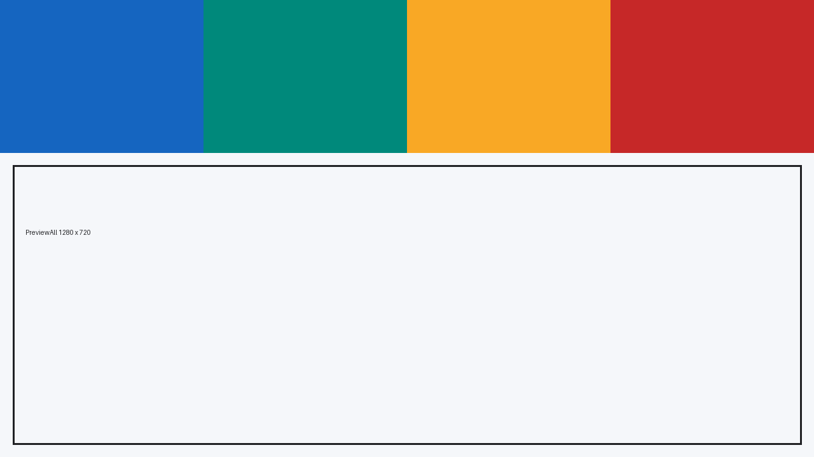
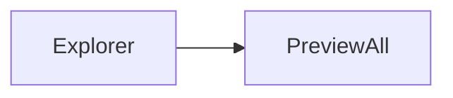

# PreviewAll Markdown fixture

Paragraph with **bold**, *italic*, ***combined***, ~~strikethrough~~, `inline code`, an escaped \*asterisk\*, and Unicode: 中文 café Ελληνικά 🚀.

## Links and image

[Qt](https://www.qt.io/) and an automatic link: <https://commonmark.org/>.



> Blockquote level one
>
> > Nested blockquote with **formatting**.

## Lists

1. Ordered item
2. Ordered item
   1. Nested ordered item

- Unordered item
  - Nested item
- [x] Completed task
- [ ] Pending task

## Table

| Format | Supported | Notes |
|:--|:--:|--:|
| PNG | yes | alpha |
| GIF | yes | animation |
| SVG | yes | vector |

## Code

```cpp
#include <QString>
QString greeting = QStringLiteral("Hello, PreviewAll");
```

```json
{"name": "PreviewAll", "enabled": true, "items": [1, 2, 3]}
```

    indented code block

---

## HTML

<details><summary>Raw HTML details</summary><p>HTML content.</p></details>

## Extended syntax samples

Footnote reference[^1], definition list-like text, math `$E = mc^2$`, and Mermaid as a fenced code block.

[^1]: Footnote text. Rendering depends on the Markdown implementation.



Hard line break here.  
Next line.
